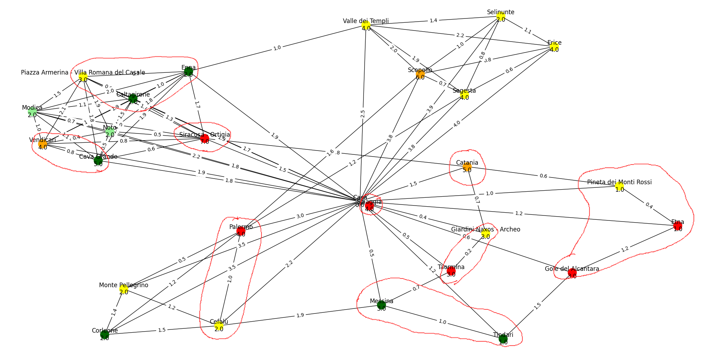

# Vacationing - A short story

One computer scientist wants to go on Vacation to Sicily.
He decides to buy a travel guide.

As he read on, he noticed his to-visit-list has become quite long-ish and 
he couldn't keep an overview of what is where and how long it would take to visit what...

Then he thought about graphs. He began organizing his information in a 
[written form](data/_sicily/__init__.py#L8-L39). Then he researched travel durations
between the attractions he would like to visit and from the hotel he will stay in 
to the POI.

After all the lame research done, he began to draw graphs, where he highlighted
attractions depending on his desire to visit them. Then he labelled the Edges with
the duration it would take to get from attraction A to attraction B.

Finally, he clustered some nodes (by hand - how lame is that?) to match the following
criteria: The total day may not exceed a given length, there may only be x days longer
than ... hours, there may only be ... attractions a day... Furthermore, overwhelmed
by the amount of things to do, he decided to visit one region of Sicily later and left
it out entirely.  

After all the hard work done, he wanted to reap the fruits of his hard search for data.
He wrote an engine which creates day routes where the first ride is the longest. 
These day routes are then written out with the following information:
* Duration of day (Rides + Visits)
* Estimated cost of visits (not including rides)
* What equipment he has to pack

He also had an old thermal printer lying around and thought:
What if I want to take the information with me in my wallet?
So he wrote a little application wrapper to print his travel programme
to his old printer.

He hopes that this information will help him during his stay.

## Entrypoints to this programme

`draw.py` - Draws a graph  
`programme.py` - Creates the holiday tours  
`print_programme.py` - Prints the programme to a parallel printer or file

Dependencies are managed using `pipenv`.
Thus you may run the scripts using `pipenv run python3 <script>`
